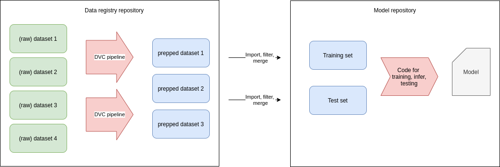
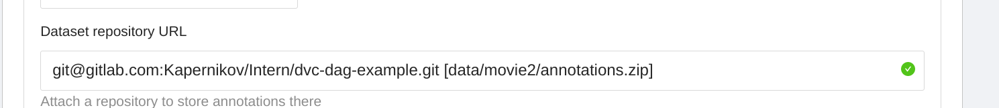
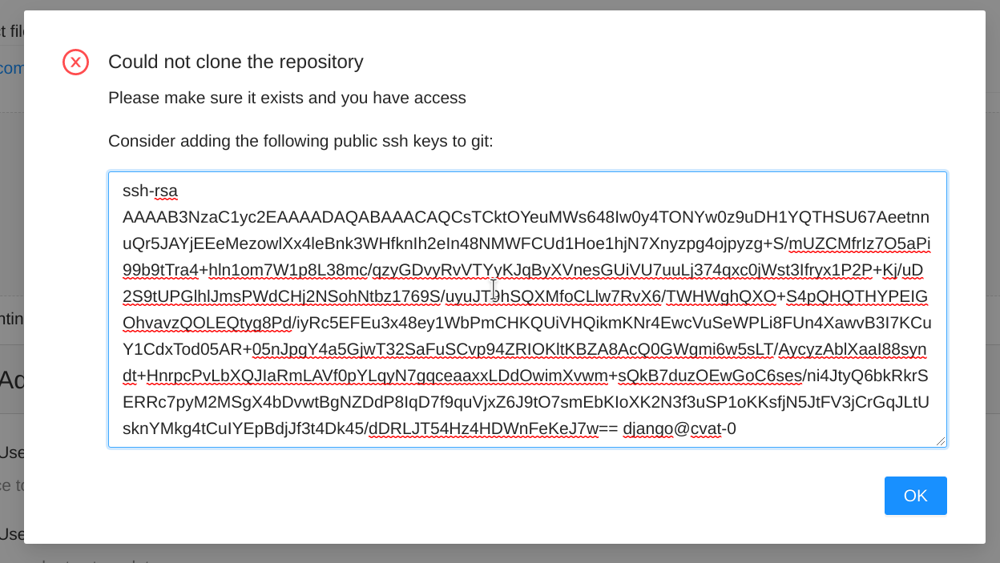
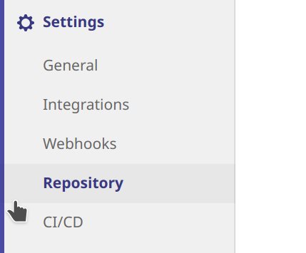
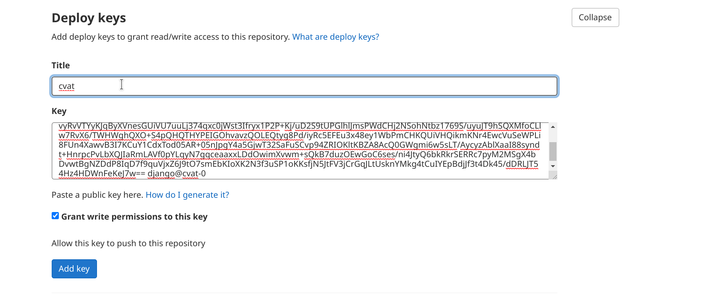
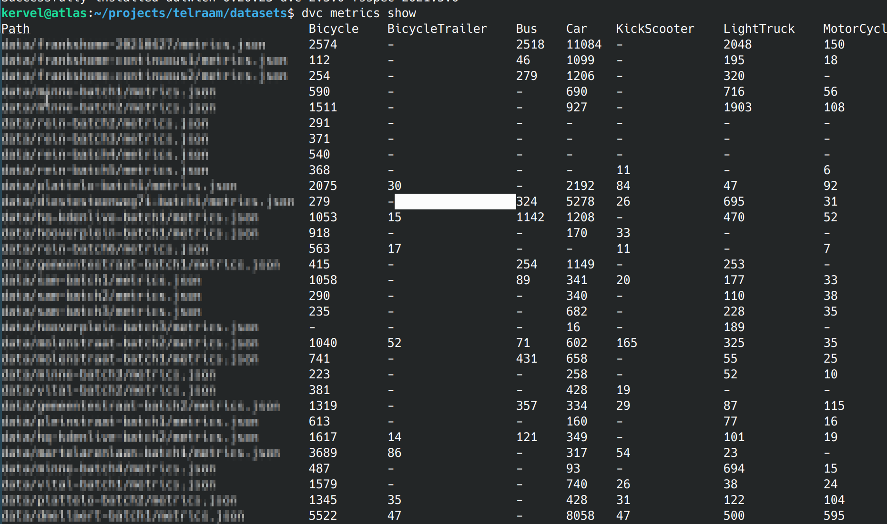

# Using DVC data registries to manage annotated datasets

[DVC](https://dvc.org/) is a tool to track dataset versions for your ML model, integrated with git. This way, you can track versions of your data and model as well as the versions of your code. You could use DVC by just adding the datasets and models you use to the git project that contains the code for training and inferencing your model.

But that doesn't always work perfectly: especially in the beginning of a project, you are exploring stuff, trying out different strategies, .... This means that your code could be a (throwaway) fork of a public github repo you are trying out, something you set up quick&dirty. Later, you will decide your strategy and keep one repository with further iterations.

DVC can already be useful *even in the exploration phase*: while you are trying out different models, you are probably also building a good training and validation dataset. You want to make this dataset available for all your quick&dirty experiments. Putting the dataset in the same repo as the code would be cumbersome in this case, as you would have to move your data all the time from one git repository to another one, while adding/removing data at the same time. That's why, in this phase, we opt for the strategy of creating [data registries](https://dvc.org/doc/use-cases/data-registries). 

A data registry is simply a repo with a number of (related) datasets, plus some scripts for preparation and cleaning, that can be used to "feed" other projects. As we will see later, DVC makes this easy.



In the above picture, we have multiple datasets (or folders with annotated/labeled data) in our registry. We think this is good practise: as you organise data collection and assembly, you will have multiple initiatives going on (maybe data gathered from different locations or from different batches). We would suggest to keep them separate and **only merge them on demand as part of DVC pipelines**. This way, you can still isolate/remove one dataset if needed, or completely change your decisions on which data you will use for training and which data you will use for validation.

So, to summarize:

* We create a "data registry": a git repo with a dvc repo for every “data effort” (collection of related datasets that took us some work to assemble)
* The git repositories with the model code will then **import** the results of the dataprep pipelines from these gitrepos. we don’t need to duplicate the full dataprep pipeline (eg from cvat to dataset) every time.

> **_NOTE_:** When setting up DVC remote storage, map all the dvc contents of one projects to one storage container or bucket. No problem if you have multiple datasets in multiple gitrepos sharing the same bucket: dvc uses content-addressable filenames so you cannot overwrite somebody elses data unless the files are identical.

> **_NOTE_:** When having tons of very little files (eg xml files with annotations), consider zipping them. It will make DVC much more efficient. In the tutorial below, we don't do that, but adding it would be easy.

# Starting a dataset project

Let's create an example project with video data annotated in Pascal VOC format (but it would go for any type of data).

```shell
mkdir myproject
cd myproject
git init
dvc init
mkdir scripts
mkdir -p data/movie1
```

Let’s put the raw `movie.mkv` in `data/movie1`. We could also do this for the annotations we got from cvat and add `pascalvoc-cvat.zip` with dvc.

Now in our inputs we have the raw input data, eg the movie we recorded and the annotations zip file (pascalvoc) we downloaded from CVAT. when we download newer version of the annotations, we will just overwrite the zipfile. So now we have a `movie.mkv` movie and a `cvat-pascalvoc.zip` being a pascalvoc dump of the CVAT annotations, both in the data/movie1 file.

Let’s add both files to dvc:

```shell
dvc add data/movie1/movie.mkv
dvc add data/movie1/cvat-pascalvoc.zip
```

### Alternative: let CVAT put the annotations in git automatically

<details>
    <summary>Show me!</summary>


> **_NOTE_:** The disadvantage of this approach is that the annotations will be in git not in dvc. Which is no problem if they don’t grow very large. Also, in your final project they will still be dvc artifacts since we will import them.

> **_NOTE_:** Currently, dvc only allows us to configure this when we create a task. so make sure you think about this **before creating the task**.

When creating a task, we just add two things: the repository url and a path (between square brackets) where cvat should put its annotations. The path can be a zip or an xml file, like this:



We will now try to add the task, but off course cvat can’t access the repo, so we get an error message:



OK, nice, cvat tells us what to do to fix it. Let’s head over to gitlab and create a deploy key with the info from above:



Make sure to give write access to our deploy key.



Now we can retry the creation in cvat (just hit the create task button again, it will keep your settings).

When we synchronize cvat will add a new branch to their repo. To get the annotations, just merge the branch. Note that cvat will always force-push the branch, so normal merging will give conflicts. To avoid this, just tell git merge to always take the cvat version:

```shell
git fetch origin
git merge -X theirs origin/cvat_12_FRANK_TEST 
```

Cvat will always upload annotations in cvat format. so we will have to add an extra pipeline to convert them to pascalvoc. Which could be done with [datumaro](https://github.com/openvinotoolkit/datumaro).


</details>

# A data preparation pipeline

We have created a [small python package called tinyvoc](https://github.com/Kapernikov/tinyvoc) with some data preparation utilities . We will use them here. Contrary to datumaro  our utilities only support pascal VOC, but that makes the source code extremely simple and easy to modify.

### Extracting individual images from the movie

In a first step of our data preparation, we will convert the movie to individual frames. Note that, for very large datasets, it might be better to do this right from your training code, but individual frames + XML pascalvoc annotations is compatible with lots of github repo’s containing models you might want to try.

Tinyvoc ships with a wrapper script video-to-frame that will call ffmpeg (you will need to install it) to convert the video to frames, and make sure the files are named in the same way as in the CVAT annotations.

Let’s use this to create a pipeline using dvc. We actually just run the script but we tell DVC how we run the script and what inputs it needs, so dvc can reproduce it later:

```shell
dvc run -n v2f_video1  \
  -d "data/movie1/movie.mkv" \
  -O "data/movie1/JPEGImages" \
  video-to-frame --source "data/movie1/movie.mkv" \
       --destination "data/movie1/JPEGImages"
```

This will not only run the script, but it will also save the commandline of the script with its dependencies in dvc.yaml so that you can rerun the script eg when you get a longer video. This is not too likely (when you get a new video, you maybe want to start a new dataset instead). 

Note that here we use -O (capital letter) instead of -o which means that DVC will generate the output `JPEGImages` but it won’t upload it to our remote storage. Makes sense, since the transformation from the video is very speedy and the jpeg images dataset would be much bigger than the video (wasting space). As a disadvantage, we can’t dvc import a non-cached output from another project.

### Preprocessing the annotations

We now want to preprocess annotations from cvat to only get the objects we are interested in. We will use dvc **parameters** to do this, let’s create a `params.yaml` file:

```yaml
annotations:
  # whether to add the "type" attribute (you can create it in CVAT) to the class names of the objects
  concat-type-attribute: False
  # valid labels
  valid-labels:
    - Pedestrian
    - Bicycle
    - Car
```

We can now read this yaml file from our python scripts to find which labels we want to keep, and which ones we want to throw away. We could off course also do this using command line arguments. But as an extra bonus, **we can tell dvc which parameters are used by our script**. This way, dvc will rerun our script when the relevant section of this file changes.

```shell
dvc run \
  -p annotations -n filter_annotations \
  -d "data/movie1/JPEGImages" -d "data/movie1/cvat-pascalvoc.zip" -o "data/movie1/Annotations" \
  -o "data/movie1/ImageSets" -o "data/movie1/labelmap.txt" \
  -m "data/movie1/metrics.json" \
  prepare-annotations --parameters params.yaml \
     --root "data/movie1" --source "data/movie1/cvat-pascalvoc.zip" \
     --destination "data/movie1/Annotations" --export-imagesets
     --metrics "data/movie1/metrics.json" 
```

This is a whole lot!

* We have to put a lot of parameters twice, once as parameter for the *tinyvoc* prepare-annotations script, and once as metadata so that dvc can track the dependencies.

* We tell dvc to depend on the annotations parameters in our params.yaml using `-p annotations`.

* We tell dvc to depend on `data/movie1/JPEGImages`, which happens to be the output of our previous pipeline stage. so now we created a dependency between the two stages!

* We add a couple of outputs using `-o`. These outputs will be pushed to our remote because here we cache them. We could as well not cache them using `-O`.

* We let our script write simple metrics (basically the number of occurences of every class) to a metrics.json, and we tell dvc about this using -m. DVC will now nicely show statistics (and how they evolve) if we do `dvc metrics show`.




### Merging multiple datasets

In our workflow, we imported and annotated several separate movies, each resulting in its own DVC pipeline. In the end, we can merge all these separate movies into one big training set and a validation set. This is the goal of the `merge-annotations` script in tinyvoc. The script is very simple, and only exists because of two reasons:

* images are symlinked instead of copied to save space
* the filenames are made unique: otherwise, multiple movies could have `frame001.jpeg`

```shell
dvc run \
  -n merge_annotations \
  -d "data/movie1/JPEGImages" -d "data/movie1/Annotations" \
  -d "data/movie2/JPEGImages" -d "data/movie2/Annotations" \
  -O "data/merged/training"
  merge-annotations \
     --source "data/movie1" --source "data/movie2" \
     --destination "data/merged/training" 
```

# Importing data in another repository

Now suppose you want to try yolo8v2, and you found a repo on github with an implementation that takes pascalvoc XML. Lets fork it and make it also a dvc project by running `dvc init`.  Add the same remote as we had in the other project:

```shell
dvc remote add azure azure://blabla/dvctest
```


Now, when importing from another project, DVC will take the connection string and remote settings from that other project. Since we don't store the azure connection string in git (instead we put it in a `config.local` file not tracked by git), dvc won't know how to connect to the remote. So let's set the connection string:

```shell
export AZURE_STORAGE_CONNECTION_STRING="blablabla"
dvc import git@gitlab.com:Kapernikov/Intern/dvc-dag-example.git data/movie1/Annotations
```

now when in the original project the contents of the dvc repo change, nothing will happen in our new project. if we want it to update to track changes in the original repo we can do 

```shell
export AZURE_STORAGE_CONNECTION_STRING="blablabla"
dvc update Annotations.dvc
```

Voila, and the data is updated.

> **_Note:_** that, unfortunately this only works for cached assets, in the above script we chose not to cache JPEGImages to save space, so dvc import won’t work for JPEGImages. If you want to import the JPEG Images, you will have to run the pipeline locally and just copy the dataset. By doing this you will loose dvc's ability to track the data all the way from the source. If you know what the limitations are, you can cope with them (eg by tracking data lineage in another way).

# Wrapping up

DVC data registries can be quite useful if you can not for some reason keep all your code / models / data in one single repository. We show one possible way of working here. If you need advice on how to set up DVC in your context or you want to automate things further, don't hesitate to [give us a call](mailto:info@kapernikov.com).